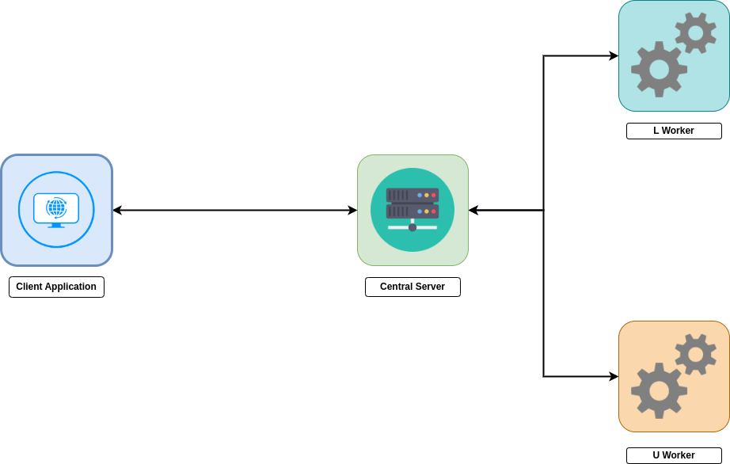

# Matrix Decomposer Service

**_A Client-Server model service built using python socket library which decomposes a given matrix_**

# Docmentation

## Architecture

| Service        | Purpose                                                   |
| -------------- | --------------------------------------------------------- |
| Central Server | Interacts with client and manages the worker servers      |
| Client         | Interact with the Central Server                          |
| L Worker       | Computes the L of a Matrix Decomposition Problem `A = LU` |
| U Worker       | Computes the U of a Matrix Decomposition Problem `A = LU` |

# Contributors

| Name             | Github ID                                     |
| ---------------- | --------------------------------------------- |
| `Amool Kuldiya`  | [amool-kk](https://github.com/Amool-kk)       |
| `Kaushal Baid`   | [kaushal168](https://github.com/kaushal168)   |
| `Niraj Kumar`    | [nirajraj-13](https://github.com/nirajraj-13) |
| `Shruti Singh`   | [Shru-Singh](https://github.com/Shru-Singh)   |
| `Swastik Sarkar` | [sswastik02](https://github.com/sswastik02)   |
